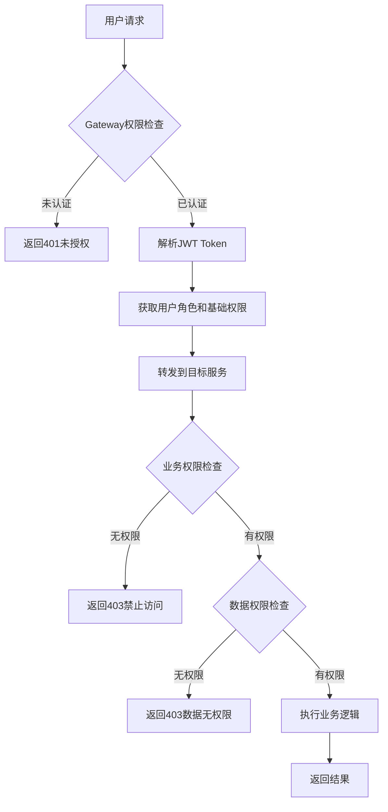

# 学途智慧教育平台 - 系统角色权限管理设计方案

## 📋 目录
- [1. 概述](#1-概述)
- [2. 权限管理架构](#2-权限管理架构)
- [3. 用户角色体系](#3-用户角色体系)
- [4. 权限分类设计](#4-权限分类设计)
- [5. 各模块权限详细设计](#5-各模块权限详细设计)
- [6. 权限验证流程](#6-权限验证流程)
- [7. 数据库设计](#7-数据库设计)
- [8. 技术实现方案](#8-技术实现方案)
- [9. 会员权益体系](#9-会员权益体系)
- [10. 实施计划](#10-实施计划)

---

## 1. 概述

### 1.1 设计目标
- 🎯 **统一权限管理**：集中管理用户角色和权限配置
- 🔒 **多层权限控制**：系统级、业务级、数据级权限验证
- 🏗️ **微服务架构适配**：适应分布式服务的权限验证需求
- 🔧 **灵活可扩展**：支持动态角色配置和权限调整
- 👥 **会员体系支持**：支持不同等级会员的差异化权益

### 1.2 权限管理原则
- **最小权限原则**：用户只获得执行工作所需的最小权限
- **角色分离原则**：管理员、讲师、学员角色明确分离
- **数据隔离原则**：用户只能访问属于自己的数据
- **权限继承原则**：高级角色继承低级角色的权限

---

## 2. 权限管理架构

### 2.1 整体架构图

```
┌─────────────────────────────────────────────────────────────────┐
│                        API网关 (Gateway)                        │
│                     统一认证和权限拦截                            │
├─────────────────────────────────────────────────────────────────┤
│                    权限管理中心 (Admin Service)                   │
│  ┌─────────────────┐  ┌─────────────────┐  ┌─────────────────┐  │
│  │   角色管理       │  │   权限管理       │  │   用户权限分配   │  │
│  │  Role Manager   │  │ Permission Mgr  │  │ User Auth Mgr   │  │
│  └─────────────────┘  └─────────────────┘  └─────────────────┘  │
├─────────────────────────────────────────────────────────────────┤
│                   身份认证服务 (User Service)                    │
│                JWT Token生成、用户角色查询                       │
├─────────────────────────────────────────────────────────────────┤
│                      业务服务权限验证                            │
│ ┌──────────────┐ ┌──────────────┐ ┌──────────────┐ ┌──────────┐ │
│ │Learning Svc  │ │Course Svc    │ │Order Svc     │ │AI Svc    │ │
│ │学习权限控制   │ │课程权限控制   │ │订单权限控制   │ │AI权限控制│ │
│ └──────────────┘ └──────────────┘ └──────────────┘ └──────────┘ │
└─────────────────────────────────────────────────────────────────┘
```

### 2.2 权限验证层次

| 层次 | 职责 | 验证内容 | 实现位置 |
|------|------|----------|----------|
| **网关层** | 统一认证 | JWT Token有效性、基础权限 | Gateway Service |
| **服务层** | 业务权限 | 角色权限、功能权限 | 各业务Service |
| **资源层** | 数据权限 | 资源访问权限、数据隔离 | Service + Database |

---

## 3. 用户角色体系

### 3.1 角色层级设计

```
                    超级管理员 (SUPER_ADMIN)
                           │
                ┌──────────┼──────────┐
                │                     │
           系统管理员 (ADMIN)      平台讲师 (TEACHER)
                │                     │
         ┌──────┼──────┐              │
         │             │              │
    运营管理员     内容审核员           │
   (OPERATOR)   (CONTENT_AUDITOR)      │
                                      │
                    ┌─────────────────┼─────────────────┐
                    │                 │                 │
               VIP会员           高级会员           普通用户
            (VIP_MEMBER)    (PREMIUM_MEMBER)   (REGULAR_USER)
                    │                 │                 │
                    └─────────────────┼─────────────────┘
                                      │
                                 试用用户
                               (TRIAL_USER)
```

### 3.2 角色详细定义

#### 3.2.1 管理类角色

| 角色名称 | 角色代码 | 权限级别 | 主要职责 | 权限范围 |
|---------|----------|----------|----------|----------|
| **超级管理员** | SUPER_ADMIN | 100 | 系统最高权限管理 | 所有系统功能和数据 |
| **系统管理员** | ADMIN | 90 | 平台运营管理 | 用户管理、数据统计、系统配置 |
| **运营管理员** | OPERATOR | 85 | 运营活动管理 | 订单管理、用户服务、营销活动 |
| **内容审核员** | CONTENT_AUDITOR | 80 | 内容审核管理 | 课程审核、评论管理、内容监控 |

#### 3.2.2 教学类角色

| 角色名称 | 角色代码 | 权限级别 | 主要职责 | 权限范围 |
|---------|----------|----------|----------|----------|
| **平台讲师** | TEACHER | 70 | 课程教学管理 | 自有课程管理、学员互动、教学数据 |
| **助教** | ASSISTANT | 60 | 辅助教学 | 协助答疑、作业批改、学习督导 |

#### 3.2.3 学员类角色

| 角色名称 | 角色代码 | 权限级别 | 主要职责 | 会员权益 |
|---------|----------|----------|----------|----------|
| **VIP会员** | VIP_MEMBER | 50 | 高级学习体验 | 全站课程、专属服务、高级功能 |
| **高级会员** | PREMIUM_MEMBER | 40 | 优质学习体验 | 精选课程、优先客服、增值功能 |
| **普通用户** | REGULAR_USER | 30 | 基础学习功能 | 免费课程、基础功能、标准服务 |
| **试用用户** | TRIAL_USER | 10 | 体验学习功能 | 限时试用、基础课程、受限功能 |

---

## 4. 权限分类设计

### 4.1 权限分类体系

#### 4.1.1 系统级权限 (System Permissions)

```yaml
系统管理权限:
  - system:admin           # 系统管理
  - system:config          # 系统配置
  - system:monitor         # 系统监控
  
用户管理权限:
  - user:create            # 创建用户
  - user:update            # 更新用户
  - user:delete            # 删除用户
  - user:view              # 查看用户
  - user:role:assign       # 分配角色
  
数据管理权限:
  - data:export            # 数据导出
  - data:import            # 数据导入
  - data:backup            # 数据备份
  - data:statistics        # 数据统计
```

#### 4.1.2 业务级权限 (Business Permissions)

```yaml
课程管理权限:
  - course:create          # 创建课程
  - course:update          # 更新课程
  - course:delete          # 删除课程
  - course:publish         # 发布课程
  - course:audit           # 审核课程
  - course:view            # 查看课程
  
学习相关权限:
  - learning:access        # 课程学习权限
  - learning:progress      # 学习进度记录
  - learning:note          # 笔记管理
  - learning:download      # 资料下载
  
订单管理权限:
  - order:create           # 创建订单
  - order:view             # 查看订单
  - order:cancel           # 取消订单
  - order:refund           # 退款处理
  
评论互动权限:
  - comment:create         # 发表评论
  - comment:reply          # 回复评论
  - comment:like           # 点赞评论
  - comment:report         # 举报评论
```

#### 4.1.3 数据级权限 (Data Permissions)

```yaml
数据访问范围:
  - data:own               # 仅访问自己的数据
  - data:department        # 访问部门数据
  - data:organization      # 访问组织数据
  - data:global            # 访问全局数据
  
课程访问权限:
  - course:free            # 免费课程访问
  - course:purchased       # 已购课程访问
  - course:vip             # VIP课程访问
  - course:trial           # 试用课程访问
```

---

## 5. 各模块权限详细设计

### 5.1 用户服务 (User Service) 权限

#### 5.1.1 功能权限矩阵

| 功能模块 | 超管 | 管理员 | 运营 | 讲师 | VIP | 高级 | 普通 | 试用 |
|---------|------|-------|------|------|-----|------|------|------|
| **用户注册** | ✅ | ✅ | ✅ | ✅ | ✅ | ✅ | ✅ | ✅ |
| **用户登录** | ✅ | ✅ | ✅ | ✅ | ✅ | ✅ | ✅ | ✅ |
| **查看用户列表** | ✅ | ✅ | ✅ | ❌ | ❌ | ❌ | ❌ | ❌ |
| **修改用户信息** | ✅ | ✅ | ✅ | 🔸 | 🔸 | 🔸 | 🔸 | 🔸 |
| **删除用户** | ✅ | ✅ | ❌ | ❌ | ❌ | ❌ | ❌ | ❌ |
| **分配角色** | ✅ | ✅ | ❌ | ❌ | ❌ | ❌ | ❌ | ❌ |
| **重置密码** | ✅ | ✅ | ✅ | ❌ | ❌ | ❌ | ❌ | ❌ |

> 🔸 表示仅能操作自己的数据

#### 5.1.2 API权限配置

```java
// 用户管理相关API权限
@PreAuthorize("hasRole('ADMIN') or hasRole('SUPER_ADMIN')")
@GetMapping("/users")
public R<PageResult<UserDTO>> getUserList();

@PreAuthorize("hasRole('ADMIN') or hasRole('SUPER_ADMIN') or authentication.principal.userId == #userId")
@PutMapping("/users/{userId}")
public R<Boolean> updateUser(@PathVariable Long userId);

@PreAuthorize("hasPermission('user:role:assign')")
@PostMapping("/users/{userId}/roles")
public R<Boolean> assignRoles(@PathVariable Long userId);
```

### 5.2 课程服务 (Course Service) 权限

#### 5.2.1 课程管理权限矩阵

| 功能模块 | 超管 | 管理员 | 审核员 | 讲师 | VIP | 高级 | 普通 | 试用 |
|---------|------|-------|-------|------|-----|------|------|------|
| **创建课程** | ✅ | ✅ | ❌ | ✅ | ❌ | ❌ | ❌ | ❌ |
| **编辑课程** | ✅ | ✅ | ❌ | 🔸 | ❌ | ❌ | ❌ | ❌ |
| **删除课程** | ✅ | ✅ | ❌ | 🔸 | ❌ | ❌ | ❌ | ❌ |
| **审核课程** | ✅ | ✅ | ✅ | ❌ | ❌ | ❌ | ❌ | ❌ |
| **发布课程** | ✅ | ✅ | ✅ | 🔸 | ❌ | ❌ | ❌ | ❌ |
| **查看课程** | ✅ | ✅ | ✅ | ✅ | ✅ | ✅ | ✅ | 🔹 |
| **下载资料** | ✅ | ✅ | ✅ | ✅ | ✅ | ✅ | 🔹 | ❌ |
| **发表评论** | ✅ | ✅ | ✅ | ✅ | ✅ | ✅ | ✅ | 🔹 |
| **管理评论** | ✅ | ✅ | ✅ | 🔸 | ❌ | ❌ | ❌ | ❌ |

> 🔸 仅能操作自己创建的内容  
> 🔹 功能受限或需要特定条件

#### 5.2.2 课程访问权限

```java
// 课程访问权限验证
public class CourseAccessControl {
    
    public boolean checkCourseAccess(Long userId, Long courseId, UserRole role) {
        Course course = courseService.getCourse(courseId);
        
        // 免费课程
        if (course.getPrice().equals(BigDecimal.ZERO)) {
            return checkFreeCourseAccess(role);
        }
        
        // 付费课程
        return checkPaidCourseAccess(userId, courseId, role);
    }
    
    private boolean checkFreeCourseAccess(UserRole role) {
        return !role.equals(UserRole.TRIAL_USER) || isTrialAllowed();
    }
    
    private boolean checkPaidCourseAccess(Long userId, Long courseId, UserRole role) {
        // VIP用户特殊权限
        if (role.equals(UserRole.VIP_MEMBER)) {
            return checkVipCourseAccess(courseId);
        }
        
        // 检查购买记录
        return orderService.hasPurchased(userId, courseId);
    }
}
```

### 5.3 学习服务 (Learning Service) 权限

#### 5.3.1 学习功能权限矩阵

| 功能模块 | 超管 | 管理员 | 讲师 | VIP | 高级 | 普通 | 试用 |
|---------|------|-------|------|-----|------|------|------|
| **课程学习** | ✅ | ✅ | ✅ | 🔹 | 🔹 | 🔹 | 🔹 |
| **进度记录** | ✅ | ✅ | ✅ | ✅ | ✅ | ✅ | 🔹 |
| **笔记管理** | ✅ | ✅ | ✅ | ✅ | ✅ | ✅ | 🔹 |
| **学习统计** | ✅ | ✅ | ✅ | ✅ | ✅ | 🔹 | ❌ |
| **学习报告** | ✅ | ✅ | ✅ | ✅ | 🔹 | ❌ | ❌ |
| **学习排名** | ✅ | ✅ | ✅ | ✅ | ✅ | ✅ | ❌ |
| **离线下载** | ✅ | ✅ | ✅ | ✅ | 🔹 | ❌ | ❌ |

> 🔹 需要课程访问权限验证

#### 5.3.2 学习权限验证实现

```java
@Service
public class LearningPermissionService {
    
    @PreAuthorize("@learningPermissionService.hasLearningPermission(authentication.principal.userId, #request.courseId)")
    public Boolean updateLearningProgress(Long userId, UpdateLearningProgressRequest request) {
        // 学习进度更新逻辑
    }
    
    public boolean hasLearningPermission(Long userId, Long courseId) {
        // 1. 获取用户角色
        UserRole role = userService.getUserRole(userId);
        
        // 2. 管理员和讲师特殊权限
        if (isAdminOrTeacher(role)) {
            return true;
        }
        
        // 3. 检查课程访问权限
        return courseAccessService.checkAccess(userId, courseId, role);
    }
}
```

### 5.4 订单服务 (Order Service) 权限

#### 5.4.1 订单操作权限矩阵

| 功能模块 | 超管 | 管理员 | 运营 | 讲师 | VIP | 高级 | 普通 | 试用 |
|---------|------|-------|------|------|-----|------|------|------|
| **创建订单** | ✅ | ✅ | ✅ | ✅ | ✅ | ✅ | ✅ | 🔹 |
| **查看订单** | ✅ | ✅ | ✅ | 🔸 | 🔸 | 🔸 | 🔸 | 🔸 |
| **取消订单** | ✅ | ✅ | ✅ | 🔸 | 🔸 | 🔸 | 🔸 | 🔸 |
| **退款处理** | ✅ | ✅ | ✅ | ❌ | 🔸 | 🔸 | 🔸 | ❌ |
| **订单统计** | ✅ | ✅ | ✅ | 🔸 | ❌ | ❌ | ❌ | ❌ |
| **批量操作** | ✅ | ✅ | ✅ | ❌ | ❌ | ❌ | ❌ | ❌ |

> 🔹 受限制条件（如试用用户不能购买某些课程）  
> 🔸 仅能操作自己的订单

### 5.5 管理服务 (Admin Service) 权限

#### 5.5.1 管理功能权限矩阵

| 功能模块 | 超管 | 管理员 | 运营 | 审核员 |
|---------|------|-------|------|-------|
| **用户管理** | ✅ | ✅ | 🔹 | ❌ |
| **角色管理** | ✅ | ✅ | ❌ | ❌ |
| **权限管理** | ✅ | 🔹 | ❌ | ❌ |
| **系统配置** | ✅ | 🔹 | ❌ | ❌ |
| **数据统计** | ✅ | ✅ | ✅ | 🔹 |
| **系统监控** | ✅ | ✅ | 🔹 | ❌ |
| **日志管理** | ✅ | ✅ | ❌ | ❌ |
| **内容审核** | ✅ | ✅ | ❌ | ✅ |

### 5.6 AI服务 (AI Service) 权限

#### 5.6.1 AI功能权限矩阵

| 功能模块 | 超管 | 管理员 | 讲师 | VIP | 高级 | 普通 | 试用 |
|---------|------|-------|------|-----|------|------|------|
| **智能问答** | ✅ | ✅ | ✅ | ✅ | ✅ | 🔹 | 🔹 |
| **学习推荐** | ✅ | ✅ | ✅ | ✅ | ✅ | ✅ | 🔹 |
| **内容分析** | ✅ | ✅ | ✅ | ✅ | 🔹 | ❌ | ❌ |
| **个性化定制** | ✅ | ✅ | ✅ | ✅ | 🔹 | ❌ | ❌ |
| **AI批改** | ✅ | ✅ | ✅ | ✅ | 🔹 | ❌ | ❌ |

> 🔹 每日使用次数限制或功能受限

---

## 6. 权限验证流程

### 6.1 统一权限验证流程图



### 6.2 权限验证层级

#### 6.2.1 Gateway层验证
```java
@Component
public class AuthFilter implements GlobalFilter {
    
    @Override
    public Mono<Void> filter(ServerWebExchange exchange, GatewayFilterChain chain) {
        String token = extractToken(exchange.getRequest());
        
        // 1. 验证Token有效性
        if (!jwtUtil.validateToken(token)) {
            return handleUnauthorized(exchange);
        }
        
        // 2. 解析用户信息
        UserAuthInfo authInfo = jwtUtil.parseToken(token);
        
        // 3. 检查基础权限
        if (!hasBasicPermission(authInfo, exchange.getRequest())) {
            return handleForbidden(exchange);
        }
        
        // 4. 添加用户信息到请求头
        return chain.filter(addUserInfo(exchange, authInfo));
    }
}
```

#### 6.2.2 Service层验证
```java
@Component
public class PermissionValidator {
    
    public void validateBusinessPermission(String permission, Long userId, Object resource) {
        UserAuthInfo authInfo = getCurrentUser();
        
        // 1. 检查角色权限
        if (!hasRolePermission(authInfo.getRoles(), permission)) {
            throw new ForbiddenException("无操作权限");
        }
        
        // 2. 检查资源权限
        if (!hasResourcePermission(userId, resource)) {
            throw new ForbiddenException("无资源权限");
        }
    }
}
```

### 6.3 权限缓存策略

#### 6.3.1 多级缓存设计
```yaml
缓存策略:
  L1缓存: # 应用内存缓存
    - 用户基础信息缓存 (5分钟)
    - 角色权限缓存 (10分钟)
    
  L2缓存: # Redis分布式缓存
    - 用户角色映射 (30分钟)
    - 权限配置缓存 (1小时)
    - 课程访问权限 (1小时)
    
  缓存更新:
    - 权限变更时实时更新
    - 定时刷新防止数据不一致
    - 缓存击穿保护
```

---

## 7. 数据库设计

### 7.1 核心权限表结构

#### 7.1.1 用户角色表 (user_role)
```sql
CREATE TABLE user_role (
    id BIGINT PRIMARY KEY AUTO_INCREMENT COMMENT '主键',
    user_id BIGINT NOT NULL COMMENT '用户ID',
    role_id BIGINT NOT NULL COMMENT '角色ID',
    assign_time DATETIME NOT NULL DEFAULT CURRENT_TIMESTAMP COMMENT '分配时间',
    expire_time DATETIME NULL COMMENT '过期时间',
    status TINYINT NOT NULL DEFAULT 1 COMMENT '状态(0:禁用,1:启用)',
    created_by BIGINT NOT NULL COMMENT '创建人',
    created_time DATETIME NOT NULL DEFAULT CURRENT_TIMESTAMP,
    updated_time DATETIME NOT NULL DEFAULT CURRENT_TIMESTAMP ON UPDATE CURRENT_TIMESTAMP,
    
    UNIQUE KEY uk_user_role (user_id, role_id),
    KEY idx_user_id (user_id),
    KEY idx_role_id (role_id),
    KEY idx_expire_time (expire_time)
) COMMENT '用户角色关联表';
```

#### 7.1.2 角色权限表 (role_permission)
```sql
CREATE TABLE role_permission (
    id BIGINT PRIMARY KEY AUTO_INCREMENT COMMENT '主键',
    role_id BIGINT NOT NULL COMMENT '角色ID',
    permission_id BIGINT NOT NULL COMMENT '权限ID',
    created_time DATETIME NOT NULL DEFAULT CURRENT_TIMESTAMP,
    
    UNIQUE KEY uk_role_permission (role_id, permission_id),
    KEY idx_role_id (role_id),
    KEY idx_permission_id (permission_id)
) COMMENT '角色权限关联表';
```

#### 7.1.3 用户课程权限表 (user_course_permission)
```sql
CREATE TABLE user_course_permission (
    id BIGINT PRIMARY KEY AUTO_INCREMENT COMMENT '主键',
    user_id BIGINT NOT NULL COMMENT '用户ID',
    course_id BIGINT NOT NULL COMMENT '课程ID',
    permission_type TINYINT NOT NULL COMMENT '权限类型(1:试用,2:购买,3:VIP,4:赠送)',
    start_time DATETIME NOT NULL COMMENT '开始时间',
    end_time DATETIME NULL COMMENT '结束时间',
    order_id BIGINT NULL COMMENT '关联订单ID',
    status TINYINT NOT NULL DEFAULT 1 COMMENT '状态(0:无效,1:有效)',
    created_time DATETIME NOT NULL DEFAULT CURRENT_TIMESTAMP,
    updated_time DATETIME NOT NULL DEFAULT CURRENT_TIMESTAMP ON UPDATE CURRENT_TIMESTAMP,
    
    UNIQUE KEY uk_user_course (user_id, course_id),
    KEY idx_user_id (user_id),
    KEY idx_course_id (course_id),
    KEY idx_order_id (order_id),
    KEY idx_end_time (end_time)
) COMMENT '用户课程权限表';
```

### 7.2 权限数据初始化

#### 7.2.1 基础角色数据
```sql
-- 插入基础角色
INSERT INTO role (role_name, description) VALUES
('SUPER_ADMIN', '超级管理员'),
('ADMIN', '系统管理员'),
('OPERATOR', '运营管理员'),
('CONTENT_AUDITOR', '内容审核员'),
('TEACHER', '平台讲师'),
('VIP_MEMBER', 'VIP会员'),
('PREMIUM_MEMBER', '高级会员'),
('REGULAR_USER', '普通用户'),
('TRIAL_USER', '试用用户');
```

#### 7.2.2 基础权限数据
```sql
-- 插入系统权限
INSERT INTO permission (permission_name, permission_key, description) VALUES
('系统管理', 'system:admin', '系统管理权限'),
('用户管理', 'user:manage', '用户管理权限'),
('课程管理', 'course:manage', '课程管理权限'),
('订单管理', 'order:manage', '订单管理权限'),
('数据统计', 'data:statistics', '数据统计权限'),
('课程学习', 'course:learn', '课程学习权限'),
('笔记管理', 'note:manage', '笔记管理权限'),
('评论管理', 'comment:manage', '评论管理权限');
```

---

## 8. 技术实现方案

### 8.1 权限注解设计

#### 8.1.1 角色权限注解
```java
@Target({ElementType.METHOD, ElementType.TYPE})
@Retention(RetentionPolicy.RUNTIME)
@Documented
public @interface RequireRole {
    String[] value() default {};
    String[] roles() default {};
    LogicalOperation logical() default LogicalOperation.OR;
}

// 使用示例
@RequireRole(roles = {"ADMIN", "SUPER_ADMIN"})
@GetMapping("/users")
public R<List<UserDTO>> getUserList() {
    // 只有管理员可以访问
}
```

#### 8.1.2 功能权限注解
```java
@Target({ElementType.METHOD})
@Retention(RetentionPolicy.RUNTIME)
@Documented
public @interface RequirePermission {
    String[] value() default {};
    String[] permissions() default {};
    LogicalOperation logical() default LogicalOperation.OR;
}

// 使用示例
@RequirePermission(permissions = {"course:manage"})
@PostMapping("/courses")
public R<CourseDTO> createCourse(@RequestBody CreateCourseRequest request) {
    // 需要课程管理权限
}
```

#### 8.1.3 课程访问权限注解
```java
@Target({ElementType.METHOD})
@Retention(RetentionPolicy.RUNTIME)
@Documented
public @interface RequireCourseAccess {
    String courseIdParam() default "courseId";
    AccessType[] accessTypes() default {AccessType.PURCHASED};
    String message() default "无课程访问权限";
}

// 使用示例
@RequireCourseAccess(courseIdParam = "request.courseId", 
                    accessTypes = {AccessType.PURCHASED, AccessType.VIP})
@PostMapping("/learning/progress")
public R<Boolean> updateProgress(@RequestBody UpdateProgressRequest request) {
    // 需要购买课程或VIP权限
}
```

### 8.2 权限拦截器实现

#### 8.2.1 统一权限拦截器
```java
@Component
@Order(1)
public class PermissionInterceptor implements HandlerInterceptor {
    
    @Override
    public boolean preHandle(HttpServletRequest request, 
                           HttpServletResponse response, 
                           Object handler) throws Exception {
        
        if (!(handler instanceof HandlerMethod)) {
            return true;
        }
        
        HandlerMethod handlerMethod = (HandlerMethod) handler;
        
        // 1. 检查角色权限
        RequireRole requireRole = handlerMethod.getMethodAnnotation(RequireRole.class);
        if (requireRole != null) {
            validateRole(requireRole);
        }
        
        // 2. 检查功能权限
        RequirePermission requirePermission = handlerMethod.getMethodAnnotation(RequirePermission.class);
        if (requirePermission != null) {
            validatePermission(requirePermission);
        }
        
        // 3. 检查课程访问权限
        RequireCourseAccess requireCourseAccess = handlerMethod.getMethodAnnotation(RequireCourseAccess.class);
        if (requireCourseAccess != null) {
            validateCourseAccess(requireCourseAccess, request);
        }
        
        return true;
    }
}
```

### 8.3 Feign客户端权限验证

#### 8.3.1 权限验证客户端
```java
@FeignClient(name = "user-service", path = "/api/auth")
public interface AuthServiceClient {
    
    @GetMapping("/users/{userId}/roles")
    R<List<String>> getUserRoles(@PathVariable("userId") Long userId);
    
    @GetMapping("/users/{userId}/permissions")
    R<List<String>> getUserPermissions(@PathVariable("userId") Long userId);
    
    @PostMapping("/validate/course-access")
    R<Boolean> validateCourseAccess(@RequestBody CourseAccessRequest request);
    
    @PostMapping("/validate/permission")
    R<Boolean> validatePermission(@RequestBody PermissionRequest request);
}
```

#### 8.3.2 权限验证请求对象
```java
@Data
public class CourseAccessRequest {
    private Long userId;
    private Long courseId;
    private List<AccessType> requiredAccessTypes;
}

@Data
public class PermissionRequest {
    private Long userId;
    private List<String> requiredPermissions;
    private LogicalOperation logical;
}
```

---

## 9. 会员权益体系

### 9.1 会员等级权益对比

| 权益类别 | 试用用户 | 普通用户 | 高级会员 | VIP会员 |
|---------|---------|----------|----------|---------|
| **免费课程** | 限时3天 | ✅ 无限制 | ✅ 无限制 | ✅ 无限制 |
| **付费课程** | ❌ | 🛒 需购买 | 🛒 需购买 | 🎁 部分免费 |
| **VIP专享课程** | ❌ | ❌ | ❌ | ✅ 免费学习 |
| **课程下载** | ❌ | ❌ | 📱 移动端 | 💻 全平台 |
| **学习统计** | 基础 | 标准 | 详细 | 专业版 |
| **AI问答** | 5次/天 | 20次/天 | 100次/天 | ♾️ 无限制 |
| **客服支持** | 机器人 | 标准 | 优先 | 专属 |
| **笔记导出** | ❌ | PDF | PDF+Word | 全格式 |
| **离线观看** | ❌ | ❌ | 7天 | 30天 |

### 9.2 会员权益技术实现

#### 9.2.1 会员权益检查
```java
@Service
public class MemberBenefitService {
    
    public boolean checkBenefit(Long userId, BenefitType benefitType) {
        UserRole userRole = userService.getUserRole(userId);
        
        switch (benefitType) {
            case FREE_COURSE_ACCESS:
                return !userRole.equals(UserRole.TRIAL_USER) || isTrialValid(userId);
                
            case VIP_COURSE_ACCESS:
                return userRole.equals(UserRole.VIP_MEMBER);
                
            case OFFLINE_DOWNLOAD:
                return userRole.getLevel() >= UserRole.PREMIUM_MEMBER.getLevel();
                
            case AI_UNLIMITED:
                return userRole.equals(UserRole.VIP_MEMBER);
                
            default:
                return false;
        }
    }
    
    public int getDailyLimit(Long userId, LimitType limitType) {
        UserRole userRole = userService.getUserRole(userId);
        
        Map<UserRole, Integer> limits = getLimitConfig(limitType);
        return limits.getOrDefault(userRole, 0);
    }
}
```

#### 9.2.2 会员权益配置
```yaml
member_benefits:
  trial_user:
    free_course_days: 3
    ai_questions_per_day: 5
    note_export: false
    offline_download: false
    
  regular_user:
    ai_questions_per_day: 20
    note_export: ["PDF"]
    offline_download: false
    customer_service: "standard"
    
  premium_member:
    ai_questions_per_day: 100
    note_export: ["PDF", "WORD"]
    offline_download_days: 7
    customer_service: "priority"
    
  vip_member:
    ai_questions_per_day: -1  # unlimited
    note_export: ["PDF", "WORD", "MARKDOWN", "TXT"]
    offline_download_days: 30
    customer_service: "exclusive"
    vip_exclusive_courses: true
```

---

## 10. 实施计划

### 10.1 开发阶段规划

#### 阶段一：基础权限框架 (2周)
- **Week 1**
  - [ ] 完善User Service的RBAC数据模型
  - [ ] 实现JWT Token中角色信息扩展
  - [ ] 开发基础权限验证组件
  
- **Week 2**
  - [ ] 实现权限注解和拦截器
  - [ ] 集成Gateway层统一认证
  - [ ] 开发权限缓存机制

#### 阶段二：业务权限集成 (3周)
- **Week 3**
  - [ ] Learning Service权限验证集成
  - [ ] Course Service权限控制实现
  - [ ] 课程访问权限验证逻辑
  
- **Week 4**
  - [ ] Order Service权限控制
  - [ ] AI Service使用限制
  - [ ] Feign客户端权限验证
  
- **Week 5**
  - [ ] 权限验证全流程测试
  - [ ] 性能优化和缓存调优
  - [ ] 错误处理和降级方案

#### 阶段三：管理功能开发 (2周)
- **Week 6**
  - [ ] Admin Service权限管理界面
  - [ ] 角色分配和权限配置功能
  - [ ] 用户权限查询和统计
  
- **Week 7**
  - [ ] 权限审计日志
  - [ ] 会员权益管理
  - [ ] 权限变更通知机制

#### 阶段四：高级功能和优化 (2周)
- **Week 8**
  - [ ] 会员体系完整实现
  - [ ] 权限动态调整机制
  - [ ] 多租户权限隔离
  
- **Week 9**
  - [ ] 权限系统压力测试
  - [ ] 安全漏洞扫描和修复
  - [ ] 文档完善和培训材料

### 10.2 测试验证计划

#### 10.2.1 功能测试用例

| 测试场景 | 测试用例 | 预期结果 |
|---------|---------|----------|
| **角色权限** | 普通用户访问管理接口 | 返回403禁止访问 |
| **课程权限** | 未购买用户学习付费课程 | 返回权限不足提示 |
| **会员权益** | VIP用户访问专享课程 | 正常访问学习 |
| **权限继承** | 管理员访问普通用户功能 | 正常访问 |
| **权限过期** | 会员到期后访问VIP功能 | 权限自动降级 |

#### 10.2.2 安全测试重点

```yaml
安全测试重点:
  权限绕过测试:
    - JWT Token伪造攻击
    - 权限提升攻击
    - 横向权限访问
    
  数据安全测试:
    - 用户数据隔离
    - 敏感信息泄露
    - SQL注入防护
    
  业务安全测试:
    - 订单权限验证
    - 课程盗链防护
    - 会员权益滥用
```

### 10.3 运维监控方案

#### 10.3.1 权限监控指标

```yaml
监控指标:
  性能指标:
    - 权限验证响应时间
    - 缓存命中率
    - 并发用户数
    
  安全指标:
    - 权限验证失败次数
    - 异常访问检测
    - 权限变更频率
    
  业务指标:
    - 各角色用户活跃度
    - 权限功能使用统计
    - 会员转化率
```

#### 10.3.2 告警规则配置

```yaml
告警规则:
  高优先级:
    - 权限验证服务宕机
    - 大量权限验证失败
    - 超级管理员异常操作
    
  中优先级:
    - 权限缓存异常
    - 服务间调用失败
    - 权限配置变更
    
  低优先级:
    - 权限验证响应时间超阈值
    - 缓存命中率下降
    - 用户权限查询频繁
```

---

## 📝 总结

本设计方案提供了一个完整的、可扩展的微服务权限管理架构，具有以下特点：

### ✅ 设计优势
- **🏗️ 分层清晰**：网关层、服务层、数据层权限验证
- **🔧 灵活配置**：支持动态角色和权限调整
- **📈 易扩展**：新增服务和权限类型方便
- **🛡️ 安全可靠**：多重验证和缓存机制
- **👥 体验友好**：差异化会员权益

### 🎯 实施建议
1. **优先实现核心权限框架**，确保基础功能可用
2. **逐步集成业务权限**，避免对现有功能影响
3. **重视权限缓存设计**，保证系统性能
4. **建立完善的测试体系**，确保权限安全
5. **准备详细的运维监控**，及时发现和处理问题

### 📚 相关文档
- [JWT Token设计规范](./JWT-Token设计规范.md)
- [微服务间调用规范](./微服务间调用规范.md)
- [数据库设计文档](./数据库设计文档.md)
- [API接口权限说明](./API接口权限说明.md)

---

*本文档将随着系统演进持续更新，如有疑问请联系架构团队。*